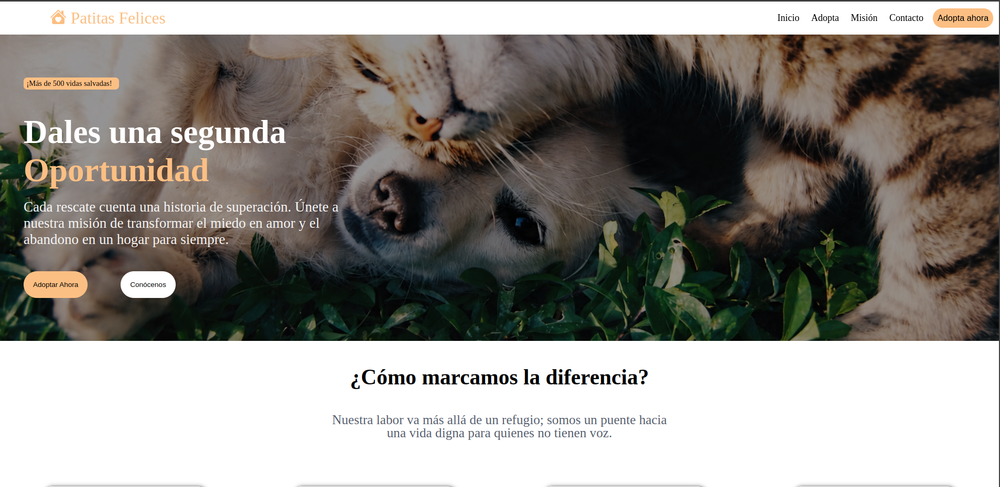
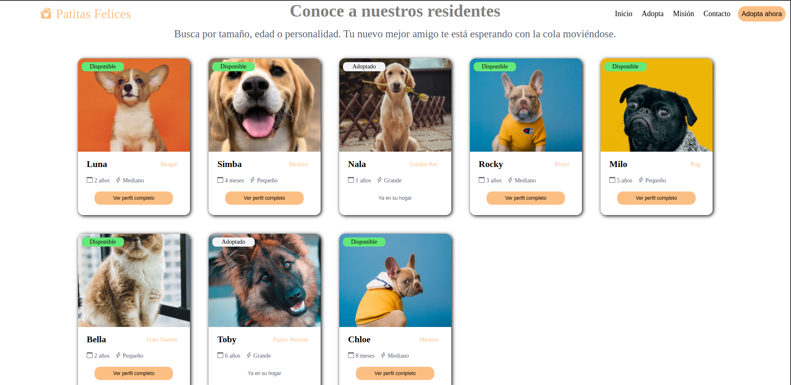
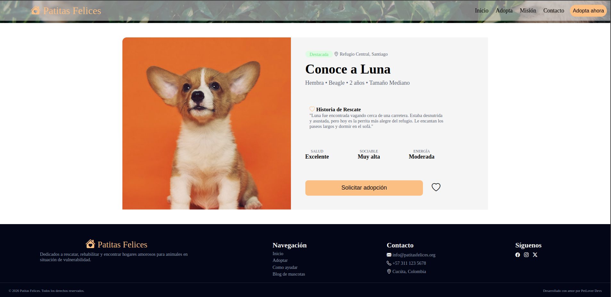
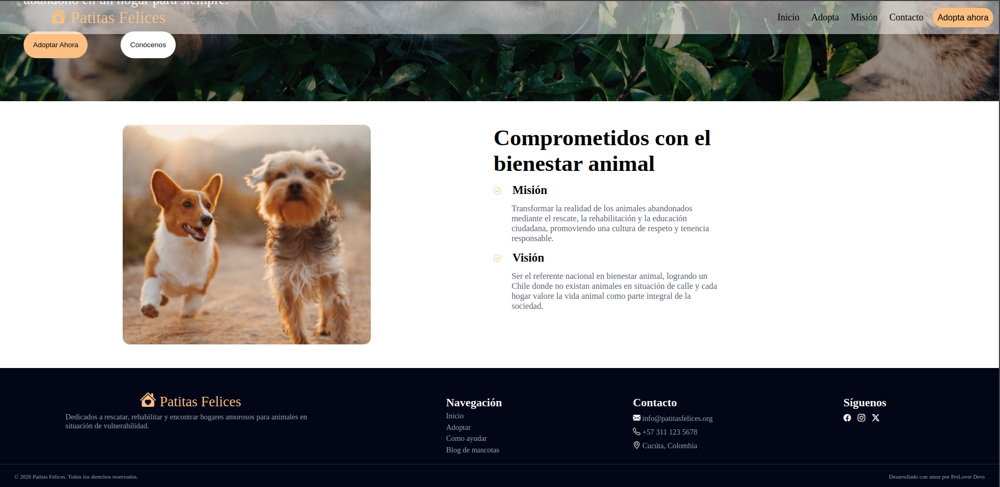
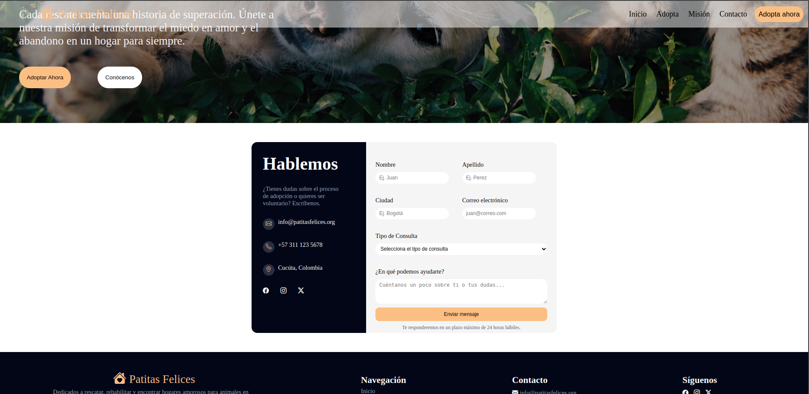

# 🐾 Patitas Felices

Maqueta web estática desarrollada para la fundación **Patitas Felices**, una organización dedicada al rescate, rehabilitación y reubicación de animales en situación de vulnerabilidad.

---

## 📋 Descripción del proyecto

Este proyecto es una maqueta frontend construida con **HTML5 y CSS3 nativo** (sin frameworks ni JavaScript), que simula la presencia digital de la fundación. Permite a los visitantes conocer la labor de la organización, explorar animales disponibles para adopción y ponerse en contacto con el equipo.

### Páginas incluidas

| Página | Archivo | Descripción |
|---|---|---|
| Inicio | `index.html` | Banner principal, secciones destacadas, galería y testimonios |
| Adopción | `adopcion.html` | Catálogo de 8 animales con estado disponible/adoptado |
| Perfil de animal | `perfil.html` | Vista detallada de un animal con historia y CTA |
| Misión y Visión | `mision.html` | Presentación institucional de la fundación |
| Contacto | `contacto.html` | Formulario de contacto con validación CSS |

### Tecnologías utilizadas

- HTML5 semántico
- CSS3 (Flexbox, Grid, animaciones, media queries)
- Bootstrap Icons (CDN)

### Características destacadas

- Diseño **responsive** con 2 breakpoints (600px, 1168px)
- Carrusel de imágenes animado con `@keyframes` sin JavaScript
- Navegación inferior en móvil
- Estados visuales diferenciados: animales disponibles vs adoptados

---

## 🚀 Instrucciones de ejecución

Este proyecto no requiere instalación de dependencias ni servidor backend.

### Opción 1 — Abrir directamente en el navegador

1. Descarga o clona el repositorio:
   ```bash
   git clone https://github.com/tu-usuario/FrontEnd-PatitasFelices.git
   ```
2. Abre la carpeta del proyecto.
3. Haz doble clic en `index.html` para abrirlo en tu navegador.

> ⚠️ **Nota:** Algunas imágenes pueden no cargar al abrir el archivo directamente por las rutas absolutas. Se recomienda usar la Opción 2.

### Opción 2 — Con Live Server (recomendado)

1. Instala la extensión **Live Server** en Visual Studio Code.
2. Abre la carpeta del proyecto en VS Code.
3. Haz clic derecho sobre `index.html` y selecciona **"Open with Live Server"**.
4. El sitio se abrirá automáticamente en `http://127.0.0.1:5500`.

### Estructura de carpetas

```
FrontEnd-PatitasFelices/
├── index.html
├── adopcion.html
├── perfil.html
├── mision.html
├── contacto.html
├── css/
│   └── style.css
├── img/
│   ├── adopcion/
│   └── perfil/
└── README.md
```

---

## 📸 Capturas de pantalla

### Inicio



### Adopción


### Perfil de animal


### Misión y Visión


### Contacto


---

## 👨‍💻 Desarrollado por

**Juan Cardenas**  
Proyecto académico — 2026
